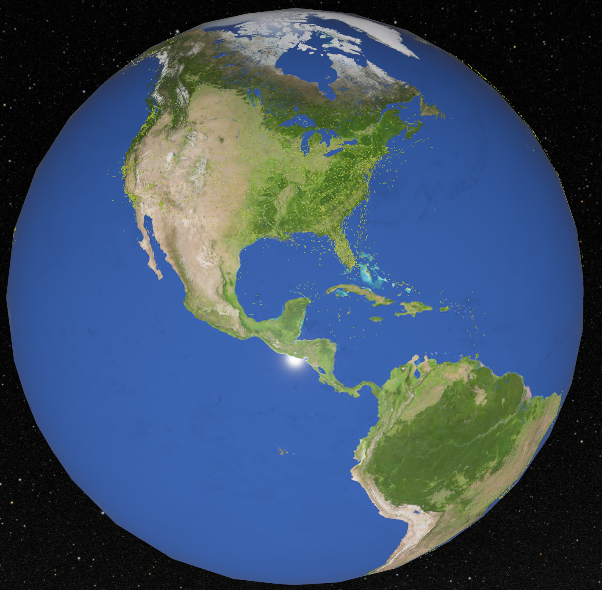

<h1 align="center">
    ADS-B Globe
</h1>

  

Renders the earth with aircraft from real-world ADS-B data.

## Resources

- ADS-B data: [ADSB.lol](https://github.com/adsblol/globe_history_2025)
- Earth textures: NASA Blue Marble Next Generation, downloaded from [Solar System Scope](https://www.solarsystemscope.com/textures/). License: CC BY 4.0
- Milky way night sky: [streets.gl](https://github.com/StrandedKitty/streets-gl/tree/dev/src/resources/textures/starmap). License: MIT
- Clickhouse: [adsb.exposed](https://github.com/ClickHouse/adsb.exposed/) for inspiration on how to store the ads-b data. License: CC BY-NC-SA 4.0
